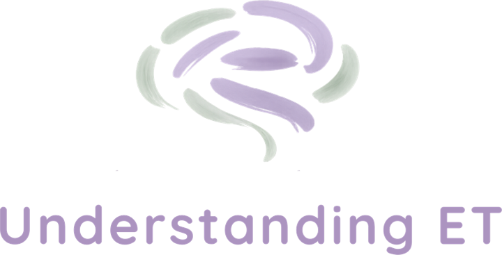

# Stepwise, by Understanding ET



A mobile app for neurodivergent adults (18+) and their team. Each task has a **strategy**.
The person ticks tasks off and rates whether the strategy helped. Their support person and
Understanding ET therapist see whether it's working and when it's time to switch.

**New here? Start with [docs/SETUP.md](docs/SETUP.md).** It walks you through trying the app in
15 minutes, then connecting the real database and inviting your first client.

## What's in the app

| Who | Screens |
|---|---|
| **Client** (the adult) | Today (tick tasks, log feelings, "Up next"), task steps + timer, check-in ("did it help?"), Tracker (week/month), My week, Notes |
| **Support person** | Overview (today + every strategy's status), strategy evidence, flag for therapist review, Tracker, Notes |
| **Therapist** | Everything support can do, plus extend a trial, switch strategy, create client profiles, invite people, a client list |

Also: opening screens and sign-up with an 18+ check, a Privacy Policy and Terms of Use (draft, see
[docs/legal](docs/legal/README.md)) with recorded consent that is asked for again when they change,
6-digit invite codes, picture mode, read-aloud, reduce-motion, phone reminders at any chosen time
(private by default; hidden in the live web version, which can't send them), an audit trail of every
change in Notes, data download, profile deletion, and account deletion (withdraws consent).

**Switch rule** (from the design handoff): helped rate = sum of ratings ÷ (2 × rated check-ins).
Fewer than 5 ratings = *Too early*; ≥ 65% *Working*; 45–64% *Mixed*; < 45% *Not working*.
A review alert appears when it's *Not working* from day 10, or when someone flags it.

## How it's built

- **App**: React Native + [Expo](https://expo.dev) (iPhone, Android and web from one codebase), TypeScript
- **Backend**: [Supabase](https://supabase.com) (Postgres, logins, row-level security)
- **Demo mode**: with no Supabase keys, the app runs on sample data stored on the device

```
App.tsx                  screens, bottom navigation, toasts
src/screens/             Onboarding, Person (Today/Task/Check-in/My week), Tracker, Team (Overview/Strategy/Notes/Clients), Settings
src/sheets/              Add task, Log a feeling, Well done, Switch strategy
src/logic/stats.ts       the switch rule and tracker maths (unit tested)
src/data/                demo and Supabase data sources (same interface)
src/state/app.tsx        navigation, loaded data and all actions
supabase/migrations/     database tables, privacy rules and server actions
supabase/tests/          47 privacy/permission tests
design/                  the original Claude Design prototype and handoff notes
```

## Not built yet

- Push notifications to the team (review alerts, flags, "worried/overwhelmed" feelings). Needs a Supabase Edge Function and push tokens.
- Sending invite emails automatically (codes are shared with the Share button for now).
- A screen for the client to see the therapist view log (the data is already recorded).
- Editing an existing task or strategy (for now, remove and re-add, or switch strategy).
- Clinic-wide admin screen (the switch-rule settings and clinician list are edited in Supabase).
- Automatic deletion of inactive profiles after 12 months (the Privacy Policy promises this; for now it's done by hand).
- Reminders in the web version (they need the App Store / Google Play app).
